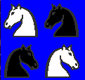
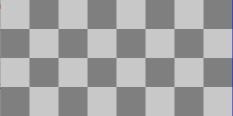

<div align="center">
<table>
    <theader>
        <tr>
            <td></td>
            <th>
                <span style="font-weight:bold;">UNIVERSIDAD NACIONAL DE SAN AGUSTIN</span><br />
                <span style="font-weight:bold;">FACULTAD DE INGENIERÍA DE PRODUCCIÓN Y SERVICIOS</span><br />
                <span style="font-weight:bold;">DEPARTAMENTO ACADÉMICO DE INGENIERÍA DE SISTEMAS E INFORMÁTICA</span><br />
                <span style="font-weight:bold;">ESCUELA PROFESIONAL DE INGENIERÍA DE SISTEMAS</span>
            </th>
            <td></td>
        </tr>
    </theader>
    <tbody>
        <tr><td colspan="3"><span style="font-weight:bold;">Formato</span>: Guía de Práctica de Laboratorio</td></tr>
        <tr><td><span style="font-weight:bold;">Aprobación</span>:  2022/03/01</td><td><span style="font-weight:bold;">Código</span>: GUIA-PRLD-001</td><td><span style="font-weight:bold;">Página</span>: 1</td></tr>
    </tbody>
</table>
</div>

<div align="center">
<span style="font-weight:bold;">INFORME DE LABORATORIO</span><br />
</div>


<table>
<theader>
<tr><th colspan="6">INFORMACIÓN BÁSICA</th></tr>
</theader>
<tbody>
<tr><td>ASIGNATURA:</td><td colspan="5">Programación Web 2</td></tr>
<tr><td>TÍTULO DE LA PRÁCTICA:</td><td colspan="5">Python</td></tr>
<tr>
<td>NÚMERO DE PRÁCTICA:</td><td>04</td><td>AÑO LECTIVO:</td><td>2022 A</td><td>NRO. SEMESTRE:</td><td>III</td>
</tr>
<tr>
<td>FECHA INICIO::</td><td>16-May-2022</td><td>FECHA FIN:</td><td>20-May-2022</td><td>DURACIÓN:</td><td>04 horas</td>
</tr>
<tr><td colspan="6">INTEGRANTES:
    <ul>
        <li>Durand Obando, Eduardo Franshu</li>
        <li>Tejada Lazo, Jordy Rolando</li>
        <li>Hurtado Bejarano, Michael Steve</li>
        <li>Chua Aguilar, Jean Carlo Leonel</li>
    </ul>
</td>
</<tr>
<tr><td colspan="6">DOCENTES:
<ul>
<li>Richart Smith Escobedo Quispe - rescobedoq@unsa.edu.pe</li>
</ul>
</td>
</<tr>
</tdbody>
</table>

# Python

[![License][license]][license-file]
[![Downloads][downloads]][releases]
[![Last Commit][last-commit]][releases]

[![Debian][Debian]][debian-site]
[![Git][Git]][git-site]
[![GitHub][GitHub]][github-site]
[![Vim][Vim]][vim-site]
[![Java][Java]][java-site]

#

## OBJETIVOS TEMAS Y COMPETENCIAS

### OBJETIVOS

-   Programar usando Python.
-   Mostrar un ejemplo de separación de intereses en clases: el modelo (lista de strings) de su vista (dibujo de gráficos).

### TEMAS
-   Listas
-   Ciclos
-   Programación orientada a objetos
-   ¿Programación funcional?

<details>
<summary>COMPETENCIAS</summary>

- C.c Diseña responsablemente sistemas, componentes o procesos para satisfacer necesidades dentro de restricciones realistas: económicas, medio ambientales, sociales, políticas, éticas, de salud, de seguridad, manufacturación y sostenibilidad.
- C.m Construye responsablemente soluciones siguiendo un proceso adecuado llevando a cabo las pruebas ajustada a los recursos disponibles del cliente.
- C.p Aplica de forma flexible técnicas, métodos, principios, normas, estándares y herramientas de ingeniería necesarias para la construcción de software e implementación de sistemas de información.

</details>


## EJERCICIOS PROPUESTOS
-   En esta tarea usted pondrá en práctica sus conocimientos de programación en Python para dibujar un tablero de Ajedrez. 
-   La parte gráfica ya está programada, usted sólo tendrá que concentrarse en las estructuras de datos subyacentes.
-   Con el código proporcionado usted dispondrá de varios objetos de tipo Picture para poder realizar su tarea:

    
-   Estos objetos estarán disponibles importando la biblioteca: [chessPictures](Tarea-del-Ajedrez/chessPictures.py) y estarán internamente representados con arreglos de strings que podrá revisar en el archivo [pieces.py](Tarea-del-Ajedrez/pieces.py)
-   La clase [Picture](Tarea-del-Ajedrez/picture.py) tiene un sólo atributo: el arreglo de strings img, el cual contendrá la representación en caracteres de la figura que se desea dibujar. 
-   La clase [Picture](Tarea-del-Ajedrez/picture.py) ya cuenta con una función implementada, no debe modificarla, pero si puede usarla para implementar sus otras funciones:
    -   _invColor: recibe un color como un caracter de texto y devuelve su color negativo, también como texto, deberá revisar el archivo [colors.py](Tarea-del-Ajedrez/colors.py) para conocer los valores negativos de cada caracter.

-   La clase [Picture](Tarea-del-Ajedrez/picture.py) contará además con varios métodos que usted deberá implementar:
    1.  verticalMirror: Devuelve el espejo vertical de la imagen
    2.  horizontalMirror: Devuelve el espejo horizontal de la imagen
    3.  negative: Devuelve un negativo de la imagen
    4.  join: Devuelve una nueva figura poniendo la figura del argumento al lado derecho de la figura actual
    5.  up: Devuelve una nueva figura poniendo la figura recibida como argumento, encima de la figura actual
    6.  under: Devuelve una nueva figura poniendo la figura recibida como argumento, sobre la figura actual
    7.  horizontalRepeat, Devuelve una nueva figura repitiendo la figura actual al costado la cantidad de veces que indique el valor de n
    8.  verticalRepeat Devuelve una nueva figura repitiendo la figura actual debajo, la cantidad de veces que indique el valor de n

-   Tenga en cuenta que para implementar todos estos métodos, sólo deberá trabajar sobre la representación interna de un Picture, es decir su atributo img.

-   Para dibujar una objeto Picture bastará importar el método draw de la biblioteca interpreter y usarlo de la siguiente manera:
    ```sh
    $ python3
    Python 3.9.2 (default, Feb 28 2021, 17:03:44) 
    [GCC 10.2.1 20210110] on linux
    Type "help", "copyright", "credits" or "license" for more information.
    ```
    ```sh
    >>> from chessPictures import *
    >>> from interpreter import draw
    pygame 1.9.6
    Hello from the pygame community. https://www.pygame.org/contribute.html
    >>> draw(rock)
    ```
    

-   Ejercicios:
    ### **COMENTARIO DEL GRUPO**
    Para resolver estos ejercicios fue necesario instalar pygame desde Windows, se instaló con el comando : 
    - *pip install pygame*
    #
    -   Para resolver los siguientes ejercicios sólo está permitido usar ciclos, condicionales, definición de listas por comprensión, sublistas, map, join, (+), lambda, zip, append, pop, range.

        1.  Implemente los métodos de la clase Picture. Se recomienda que implemente la clase picture por etapas, probando realizar los dibujos que se muestran en la siguiente preguntas.
            - Para implementar las funciones de "picture" nuestro grupo se dividió en equipos de 2 personas, las otras dos se ocuparon de resolver la parte de dibujar las imágenes (Punto 2).
            - Utilizamos el ejercicio 2a para hacer las pruebas de dibujar piezas, estas pruebas estan comentadas.
            
             ```sh
                #draw(rock)
                #draw(rock.verticalMirror())
                #draw(knight)
                #draw(knight.horizontalMirror())
                #draw(knight.negative())
                #draw(knight.join(queen))
                #draw(knight.up(rock))
                #draw(knight.under(king))
                #draw(knight.horizontalRepeat(3))
                #draw(knight.verticalRepeat(3))
            ```
        2.  Usando únicamente los métodos de los objetos de la clase Picture dibuje las siguientes figuras (invoque a draw):

            - Los 2 integrantes restantes se enfocaron en realizar estos ejercicios del punto 2.
            #
            *    (a) 
  
            ```sh
                # Caballo cambia a su color inverso (Negativo)
                caballoN = knight.negative() 

                # Al caballo normal le agregamos uno negativo al lado
                caballosHorizontal1 = knight.join(caballoN) 

                # Al caballo negativo le agregamos un caballo normal
                caballosHorizontal2 = caballoN.join(knight) 

                # Juntamos lo anterior
                figura = caballosHorizontal1.up(caballosHorizontal2) 
                draw(figura) # Diujamos

                _________________________________________________________
                Dividimos el ejercicio en 2 figuras que luego juntamos:

                1) En la primera figura tenemos un caballo blanco y a 
                través de un método join colocámos un caballo negro al 
                lado suyo.

                2) En la segunda figura tenemos un caballo negro y a 
                través de un método join colocámos un caballo blanco al 
                lado suyo.

                - Finalemente juntamos las 2 figuras (primera sobre
                 segunda usando up) y las imprimimos.
            ```
            *    (b) 
            
            ```sh
                caballoN = knight.negative()
                caballosHorizontal1 = knight.join(caballoN)
                #aqui se invierte a los caballos de la fila 1 
                caballosHorizontal2Invertido = 
                caballosHorizontal1.horizontalMirror()

                figura = 
                caballosHorizontal1.up(caballosHorizontal2Invertido)
                draw(figura)

                ________________________________________________________
                Dividimos el ejercicio en 2 figuras que luego juntamos:

                1) En la primera figura tenemos un caballo blanco y a 
                través de un método join colocámos un caballo negro al 
                lado suyo.

                2) En la segunda figura invertimos la primera figura

                - Finalemente juntamos las 2 figuras (la primera sobre 
                  la segunda usando up) y las imprimimos.

            ```

            *    (c) 

            ```sh
                #Reina repetida n veces horizontalmente
                draw(queen.horizontalRepeat(4))
                ________________________________________

                Solo se repite la figura 4 veces para luego dibujarla.
            ```

            *    (d) 

            ```sh
                casillaN = square.negative()
                # Uniendo casilla negativa a una casilla blanca(normal)
                casillaBN = square.join(casillaN)
                #repeticion de n veces horizontalmente
                draw(casillaBN.horizontalRepeat(4))

                _______________________________________________
                
                Se busca tener una figura que sea un par de cuadrados
                (cuadrado claro - cuadrado oscuro) para luego repetirla
                4 veces, y así formar la imagen del ejercicio
            ```

            *    (e) 

            ```sh
                # La misma lógica del ejercicio d pero aplicada a este
                cuadradoNegativo = square.negative()
                parCuadrados = cuadradoNegativo.join(square)
                draw(parCuadrados.horizontalRepeat(4))
                
                _______________________________________________
                
                Se busca tener una figura que sea un par de cuadrados
                (cuadrado oscuro - cuadrado claro) para luego repetirla
                4 veces, y así formar la imagen del ejercicio
            ```

            *    (f) 

            ```sh
                #Se generan  dos lineas en "blanco"
                filasCasillo1 = square.negative().join(square)
                filasCasillo1 = filasCasillo1.horizontalRepeat(4);
                filasCasilla2 = filasCasillo1.negative()
                filasCompletasB = filasCasillo1.under(filasCasilla2);

                draw(filasCompletasB.under(filasCompletasB))
                
                _______________________________________________
                Se buscan obtener 4 filas en donde el color de las 
                casilla sea alternado. Siguiendo la lógica del ejercicio 
                2d y 2e podemos duplicar cada fila y ponerla según nuestra
                conveniencia, obteniendo el resultado             

            ```

            *    (g) 

            ```sh

            Se desea obtener un tablero de ajedrez.
            Con el objeto square, el cual representa un cuadrado de un color, podemos ir 'pintando' sobre él la figura que nosotros deseemos, y en base a condiciones que le demos alternaremos el color de fondo del square. Si obtenemos una fila completa, lo demás es solo jugar con los valores y las propiedades creadas previamente, de esta manera al final uniremos el grupo de Blancas con el grupo de Negras, insertando entre estas dos los filas de cuadrados del ejercicio ef.
                
            ```

#

## CUESTIONARIO
-   ¿Qué son los archivos *.pyc?
    - Los archivos .pyc son utilizados por el lenguaje de programación Python. PYC es un archivo ejecutable que contiene el código de bytes compilado de un programa escrito en Python. Bytecode es un conjunto de instrucciones  que permiten al intérprete ejecutar el programa.
    - Los archivos PYC vienen con archivos PY asociados. Python compila un archivo PY y guarda el resultado del proceso en un archivo PYC, que luego se puede usar para ejecutar programas.
-   ¿Para qué sirve el directorio __pycache__?
    -  Cuando se ejecuta un programa de Python, el intérprete primero lo compila en código de bytes (esto es una simplificación excesiva) y lo almacena en el directorio __pycache__. Si mira allí, encontrará un montón de archivos con el mismo nombre que  los archivos .py en el directorio de su proyecto, solo que su extensión es .pyc o .pyo. Estas son versiones de bytecode optimizadas y bytecode compiladas  de sus archivos de  programa, respectivamente.
-   ¿Cuáles son los usos y lo que representa el subguión en Python?
    - Almacena el valor de la última expresión en el intérprete.
    - Ignora valores específicos. 
    - Asigna significados y funciones especiales a nombres de variables o fuciones. 
    - Separa el valor del número

#

## REFERENCIAS
-   https://www.w3schools.com/python/python_reference.asp
-   https://docs.python.org/3/tutorial/
-   https://www.pygame.org

#

[license]: https://img.shields.io/github/license/rescobedoq/pw2?label=rescobedoq
[license-file]: https://github.com/rescobedoq/pw2/blob/main/LICENSE

[downloads]: https://img.shields.io/github/downloads/rescobedoq/pw2/total?label=Downloads
[releases]: https://github.com/rescobedoq/pw2/releases/

[last-commit]: https://img.shields.io/github/last-commit/rescobedoq/pw2?label=Last%20Commit

[Debian]: https://img.shields.io/badge/Debian-D70A53?style=for-the-badge&logo=debian&logoColor=white
[debian-site]: https://www.debian.org/index.es.html

[Git]: https://img.shields.io/badge/git-%23F05033.svg?style=for-the-badge&logo=git&logoColor=white
[git-site]: https://git-scm.com/

[GitHub]: https://img.shields.io/badge/github-%23121011.svg?style=for-the-badge&logo=github&logoColor=white
[github-site]: https://github.com/

[Vim]: https://img.shields.io/badge/VIM-%2311AB00.svg?style=for-the-badge&logo=vim&logoColor=white
[vim-site]: https://www.vim.org/

[Java]: https://img.shields.io/badge/java-%23ED8B00.svg?style=for-the-badge&logo=java&logoColor=white
[java-site]: https://docs.oracle.com/javase/tutorial/


[![Debian][Debian]][debian-site]
[![Git][Git]][git-site]
[![GitHub][GitHub]][github-site]
[![Vim][Vim]][vim-site]
[![Java][Java]][java-site]


[![License][license]][license-file]
[![Downloads][downloads]][releases]
[![Last Commit][last-commit]][releases]
